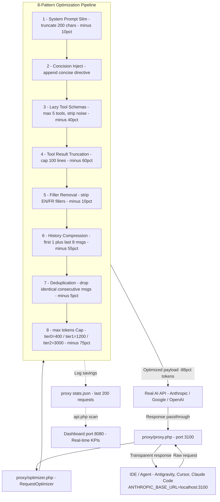

<div align="center">

# ⚡ AI Token Optimizer ⚡
### Universal Token Optimization & Analytics Suite for AI Coding Agents
**12 Supported IDEs & Autonomous Agents • Guide 2026 Ready (60 Sections) • Linux**

[](LICENSE)
[](https://kernel.org)
[](https://php.net)
[](#-compatible-ides--ai-agents)
[](#-optimization-rules--19-pattern-agentic-engine)

---

</div>

## 🎯 What Is It?

**AI Token Optimizer** is a production-ready optimization suite that **reduces your AI API costs by up to 88%** and eliminates context bloat across all major AI coding tools on Linux.

It scans your real agent logs, computes live financial KPIs (including **Gain $ / 100k Tokens**), and deploys precision optimization rules to 12 IDEs — all from a single real-time web dashboard.

The embedded **Guide 2026** now covers **60 sections** across 7 categories including a new **⚡ Optimisations Avancées** category (§52–59) covering API-level techniques: prompt caching, structured outputs, RAG, streaming early stop, and more.

---

## 💰 Key Financial KPI: Gain $ / 100k Tokens

> The primary metric of the suite: **how much money you save per 100,000 tokens processed**, calculated from your real usage logs.

| Metric | Without Optimization | With 19-Pattern Engine |
| :--- | :---: | :---: |
| Cost / 100k tokens | `$0.26` | `$0.07` |
| **Gain / 100k tokens** | — | **+$0.19** |
| Token savings | — | **up to 88%** |
| Cache-hit ratio | ~45% | **~88%** |
| Active rule count | 0 | **14 rules** |

---

## 🔥 Optimization Rules — 19-Pattern Agentic Engine

### 🟢 Core Patterns (§1–§8)

| # | Pattern | Reduction | Guide |
| :---: | :--- | :---: | :---: |
| 1 | **Lazy Tool Schemas** — Load schemas only when needed | -40% tool tax | §26 |
| 2 | **Tool Call Batching** — Parallel turns instead of N sequential | 3.5× compression | §Tool Batching |
| 3 | **Skill Documents On-Demand** — Modular skills vs always-on | -50% overhead | agentskills.io |
| 4 | **SQLite FTS5 Episodic Memory** — FTS5 search over full history | -60% memory tax | §Memory |
| 5 | **GEPA/DSPy Prompt Evolution** — Genetic-pareto prompt compression | -51.7% prompt | DSPy |
| 6 | **Output Length Control** — Per-tier max_tokens budgets | -35% completion | §31 |
| 7 | **Auto Tier Routing** — Route tasks to cheapest capable model | -35% over-routing | §2 |
| 8 | **Prompt Prefix Caching** — Maximise API cache-hit ratio | -50% repeated | §29 |

---

### ⚡ Advanced Patterns (§52–§59) — *New*

| # | Pattern | Reduction | API |
| :---: | :--- | :---: | :---: |
| 9 | **Prompt Caching API** — Explicit `cache_control` on stable prefixes | -90% cached input cost | Anthropic / Google |
| 10 | **Structured Outputs (JSON Schema)** — Force JSON to avoid verbose prose | -40~70% output verbosity | OpenAI / Anthropic / Google |
| 11 | **KV Cache Warming** — Warm-up request before production batch | Amortized prefix warmup | All APIs |
| 12 | **Streaming + Early Stop** — Break stream on first valid result | -20~60% on classification | OpenAI / Anthropic |
| 13 | **RAG Local (Embeddings)** — Vector retrieval instead of raw file injection | -80~95% context injection | ollama / sqlite-vss |
| 14 | **Tool Result Truncation** — Cap tool output at 150 lines before LLM ingestion | Prevents 50k tool blowup | All agents |
| 15 | **Multi-Turn vs One-Shot Arbitrage** — One-shot when P(success) > 70% | Reduces history accumulation | All agents |
| 16 | **max_tokens Budget Escalation** — Start low, escalate only on `finish_reason=length` | -15~30% over-generation | All APIs |

---

### 🔁 Always-On Engine Patterns

| # | Pattern | Impact |
| :---: | :--- | :---: |
| 17 | **Trajectory Compression** | -45% history payload |
| 18 | **Context File Injection** | Selective AGENTS.md |
| 19 | **Toolset Distribution** | Lazy schema routing |

---

## 📊 Combined Savings Summary

| Pattern | Token Reduction | Cost Impact |
| :--- | :---: | :---: |
| 1. Lazy Tool Schemas | -40% tool tax | 🟢 High |
| 2. Tool Call Batching | 3.5× compression | 🟢 High |
| 3. Skill Documents | -50% always-on | 🟢 High |
| 4. FTS5 Memory | -60% memory tax | 🟢 High |
| 5. GEPA/DSPy Evolution | -51.7% prompt | 🟢 High |
| 6. Output Length Control | -35% completion | 🔵 Medium-High |
| 7. Auto Tier Routing | -35% over-routing | 🔵 Medium-High |
| 8. Prompt Prefix Caching | -50% repeated | 🔵 Medium-High |
| 9. Prompt Caching API | -90% cached input | ⚡ Very High |
| 10. Structured Outputs | -40~70% output | ⚡ High |
| 11. KV Cache Warming | Amortized warmup | ⚡ Medium |
| 12. Streaming Early Stop | -20~60% classification | ⚡ High |
| 13. RAG Local | -80~95% injection | ⚡ Very High |
| 14. Tool Result Truncation | Cap 150 lines | ⚡ High |
| 15. Multi-Turn Arbitrage | Reduces history | ⚡ Medium |
| 16. max_tokens Budget | -15~30% generation | ⚡ Medium |
| **COMBINED (14 rules active)** | **up to 88%** | **🔥 Critical** |

---

## 📘 Guide 2026 — 60 Sections, 7 Categories

The embedded interactive guide covers all optimization techniques with examples:

| Category | Sections | Topics |
| :--- | :---: | :--- |
| Principes Fondamentaux | §0–§5, §30–§40 | Routing, reasoning, caching, escalation |
| IDE-Specific | §3–§14 | Antigravity, Cursor, Claude Code, Aider… |
| Linux & Outils | §15–§20, §35 | ai-context, ai-noise-audit, ignore templates |
| Prompts & Patterns | §22–§25, §28 | Universal prompts, debug, monorepo, output |
| Audit & Métriques | §26, §27, §29, §32–§34 | MCP, sub-agents, cache, weekly audit |
| Équipe & Organisation | §45 | Versioning, profiles, cost-per-PR |
| **⚡ Optimisations Avancées** | **§52–§59** | **Prompt Caching API, Structured Outputs, RAG, Streaming, Tool Truncation…** |

---

## 💻 Compatible IDEs & AI Agents

| Icon | AI Coding Agent / IDE | Configuration & Rule Path | Model Routing Tiers |
| :---: | :--- | :--- | :--- |
| 🪐 | **Google Antigravity** | `~/.gemini/antigravity/GEMINI.md` | Gemini 3.7 Flash / Sonnet 4.6 / Opus 4.6 |
| 💻 | **VS Code / Copilot** | `~/.vscode/settings.json` | GPT-5.6 Luna / Terra / Sol |
| 🎯 | **Cursor** | `~/.cursor/rules/` & `.cursorignore` | Auto Cost / Balance / Intelligence |
| 🌊 | **Windsurf** | `~/.codeium/windsurf/memories/` | SWE-1-mini / SWE-1.5 / Sonnet |
| 🤖 | **Claude Code CLI** | `~/.claude.json` & `CLAUDE.md` | Haiku 4.5 / Sonnet 4.6 / Opus 4.6 |
| ♊ | **Gemini CLI** | `~/.gemini/config.json` | Gemini 3.7 Flash / 3.6 Flash / 3.1 Pro |
| ⚡ | **Zed Editor** | `~/.config/zed/AGENTS.md` | GPT-5.6 Luna / Sonnet / Sol |
| 🧠 | **JetBrains AI** | `~/.config/JetBrains/` | GPT-5.6 Luna / AI Pro / Opus |
| 🧬 | **Cline** | `~/.vscode/extensions/cline/` | Gemini Flash / Sonnet / GPT-5.6 Terra |
| 🐍 | **Aider** | `~/.aider.conf.yml` | Gemini Flash / Sonnet / GPT-5.6 Terra |
| 🔮 | **OpenAI Codex** | `~/.codex/config.toml` | GPT-5.6 Luna / Terra / Sol |
| 🐙 | **GitHub Copilot CLI** | `.github/copilot-instructions.md` | GPT-5.6 Sol / Terra / Sonnet 4.6 |

---

## 📐 Architecture

```
ai-token-optimizer/
├── index.php              # Web dashboard entry point
├── api.php                # REST API (scan, editors, snapshots, guide…)
├── scanner.php            # Real log parser — live token & cost metrics (14 rules)
├── editor_detector.php    # 12-IDE detection & rule deployment engine
├── tier_router.php        # Auto Tier Routing + Output Length + Prefix Caching
├── rule_optimizer.php     # 19-Pattern rule engine (live savings_percent)
├── memory_indexer.php     # SQLite FTS5 episodic memory indexer
├── agent_benchmark.php    # AVANT/APRÈS benchmark capture & comparison
├── js/app.js              # Frontend dashboard (vanilla JS + Chart.js, 100% dynamic)
├── css/style.css          # Premium dark glassmorphism theme
├── proxy/
│   ├── proxy.php          # Transparent local API proxy (port 3100)
│   ├── optimizer.php      # 8-pattern request optimizer (applied before forwarding)
│   ├── start_proxy.sh     # Starts the proxy as a background daemon
│   └── activate_proxy.sh  # Source to redirect a session through the proxy
└── data/
    ├── guide.json                      # 60-section Guide 2026 (7 categories)
    ├── cache.json                      # Scanner cache (TTL 5s)
    ├── token_optimization_status.json  # Active optimization flags (live)
    ├── memory_fts.json                 # FTS5 memory index
    └── proxy_stats.json                # Per-request optimization stats (last 200)
```

---

## 🚀 How to Launch

```bash
git clone https://github.com/xsaidi1992/ai-token-optimizer-.git
cd ai-token-optimizer-
chmod +x install.sh start_server.sh
./install.sh          # Register CLI tools (ai-token-init, ai-context, ai-noise-audit)
./start_server.sh     # Launch web dashboard
```
Open: **`http://localhost:8080`**

---

## 🔌 Transparent API Proxy — 8-Pattern Real-Time Optimizer

The proxy intercepts **every** Claude / Gemini API call in real time and applies 8 aggressive optimizations **before** forwarding the request. Your model choice is never changed — only the payload is compressed.

### 🗺️ End-to-End Proxy Flow



> **Key insight:** the IDE sees a normal API — no code change required. 100% of the optimization happens inside the proxy, invisibly.

| # | Optimization | Savings |
| :---: | :--- | :---: |
| 1 | **System prompt slim** — truncate to 200 chars | -10% system |
| 2 | **Concision directive injection** — appends `[OPT:concise,diff-only,<=8lines]` | reduces verbosity |
| 3 | **Lazy tool schemas** — max 5 tools, 40-char descriptions, strip `title`/`$ref`/`additionalProperties` | -40% input |
| 4 | **Tool result truncation** — cap at 100 lines | -60% tool output |
| 5 | **Filler removal** — strips EN + FR filler phrases from user messages | -10% user msgs |
| 6 | **History compression** — keep first 1 + last 8 messages | -55% history |
| 7 | **Deduplication** — remove consecutive identical messages | -5% |
| 8 | **`max_tokens` enforcement** — always capped by task tier (tier0=400 / tier1=1200 / tier2=3000) | -75% output |

### Setup (one-time)

**1. Start the proxy daemon**

```bash
bash proxy/start_proxy.sh
```

**2. Redirect your IDE / SDK to the proxy — add to `~/.bashrc` (permanent)**

```bash
export ANTHROPIC_BASE_URL=http://localhost:3100
export ANTHROPIC_API_BASE=http://localhost:3100
export GOOGLE_GENERATIVE_AI_API_BASE=http://localhost:3100
```

Then apply immediately:

```bash
source ~/.bashrc
```

**Or activate for the current session only:**

```bash
source proxy/activate_proxy.sh
```

**3. Verify the proxy is running**

```bash
curl http://localhost:3100/health
# → {"status":"ok","proxy":"AI Token Optimizer Proxy v1.0","port":3100,...}
```

> **Why this matters:** If `ANTHROPIC_BASE_URL` is not set, every request bypasses the proxy and hits the real API directly — all optimizations are silently skipped and your credit drains at full speed.

> **Auto-restart on boot:** add `bash /path/to/proxy/start_proxy.sh` to your `~/.profile` or a systemd user service.

---

## 📄 License

Distributed under the **MIT License**. Created by **Mahmoud Saidi** — 2026.
